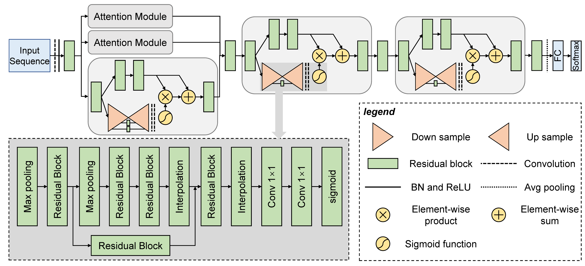

# MAResNet
The architecture of MAResNet


```
## Dependencies

MAResNet is work under Python 3.8.
The required dependencies for MAResNet are in requirements.txt file.

torchvision==0.9.1      
pandas==1.2.3
numpy==1.20.2           
torch==1.8.1
scikit_learn==0.24.2
```


# Prediction by a example model

To predict transcription factor binding sites use `prediction.py` script with the following parameter:

* `model_path`             str, path of the MAResNet model for prediction.
* `seq_file`            str, path of the sequence file for prediction sequence. (the sequence file format: you can get from `example/seq_file/pre_data.data`)
* `output`             str, output path of the prediction result.

Generated files (see `example/result_file/`):
* `result.xlsx` shows the possibility of transcription factor binding sites.
```
python prediction.py ./example/model_weights/maresnet-41-best.pth ./example/seq_file/pre_data.data  ./example/result_file
```


# Training MAResNet on cell datasets

If you want to train this model on cell datasets, you need to download the cell datasets (see the dataset section) to `Dataset/cell_dataset` folder.

```
python train_on_cell_datasets.py
```

# Output:

The models will save in `checkpoint` folder, and the prediction results and the log file will save in `runs` folder.


# Training MAResNet on 690 ChIP-seq datasets

## Option 1: Training MAResNet on global dataset

you need to download the global dataset (see the dataset section) to `Dataset/global_dataset` folder.

```
python train_on_global_dataset.py
```

## Output:

The models will save in `checkpoint` folder, and the prediction results and the log file will save in `runs` folder.

## Option 2: Training MAResNet on 690 datasets

you need to download the 690 ChIP-seq datasets (see the dataset section) to `Dataset/690_dataset` folder.
```
python transform_on_690datasets.py
```

## Output:
The models will save in `checkpoint_transfer` folder, and the prediction results and the log file will save in `runs_transfer` folder.


# Data
Data (train, validation and test) used for training MAResNet model can be downloaded from:
http://csbio.njust.edu.cn/bioinf/maresnet/datasets.html
Uncompress these datasets to `Dataset` folder.
```
Dataset
├── 690_dataset     <-    Transfer learning Datasets
│	├── wgEncodeAwgTfbsBroadDnd41CtcfUniPk
│	│	├── test.data
│	│	├── train.data
│	│	└── valid.data
│	├── ...
│	...
├── cell_dataset    <-    Cell line Datasets (A549, H1hesc, Huvec, Mcf7 forder)
│	├── A549
│	│	├── test.data
│	│	├── train.data
│	│	└── valid.data
│	├── ...
│	...
└── global_dataset  <-    Global training Datasets (train.data, valid.data, test.data)
    ├── test.data
    ├── train.data
    └── valid.data
```
## Contact:
[Long-Chen Shen] (https://github.com/shenlongchen/maresnet): shenlc1995@gmail.com
Dong-Jun Yu: njyudj@njust.edu.cn
Jiangning Song: jiangning.song@monash.edu
